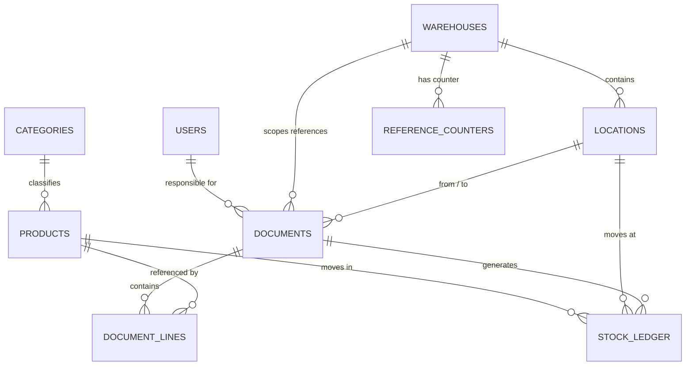
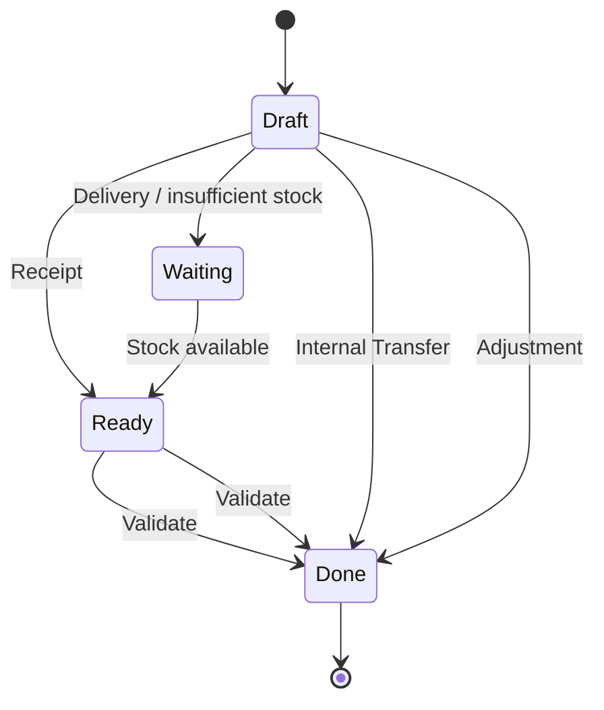

<div align="center">

# 📦 StockSense

### Audit-First Inventory Management System

**A centralized inventory platform where every stock movement is traceable, auditable, and derived from a single source of truth.**

Built for the **Odoo Virtual Hackathon** 🚀

[](#)
[](#)
[](#)
[](#)
[](#)
[](#)

</div>

---

## 🎯 What is StockSense?

StockSense is a modular inventory management system designed to give small and mid-sized businesses a reliable **single source of truth for stock**.

Traditional inventory systems often rely on spreadsheets, manual registers, or disconnected tools. This makes it difficult to answer simple but important questions:

- How much stock do we actually have?
- Where is that stock located?
- What changed the quantity?
- Who performed the operation?
- When did the movement happen?
- Can we trace the current quantity back to its source?

StockSense addresses this by recording every completed stock movement in an **append-only Stock Ledger**.

> ### 🔑 Core Principle
> **Stock quantity is never edited directly.**
>
> Current stock is derived from the ledger:
>
> **`On Hand = SUM(quantity_delta)`**
>
> This makes stock movement traceable and provides a complete audit history without maintaining a separate manually updated stock counter.

---

# ✨ Why StockSense?

StockSense is built around four ideas:

| Principle | What it means |
|---|---|
| **Single Source of Truth** | The Stock Ledger is the authoritative source for inventory quantity. |
| **Auditability** | Every completed movement can be traced to a document, product, location, user, and timestamp. |
| **Controlled Workflows** | Stock changes only when a document reaches its appropriate completed state. |
| **Location Awareness** | Inventory is tracked at the warehouse/location level rather than only as a global quantity. |

This design keeps the system simple enough for a hackathon while following patterns that can scale into a more complete warehouse management solution.

---

# 🚀 Demo Flow

The complete inventory lifecycle can be demonstrated with four operations:

```text
Receive Stock
     ↓
Internal Transfer
     ↓
Customer Delivery
     ↓
Inventory Adjustment
     ↓
View Complete Move History
```

### Example

1. Receive **100 kg Steel**
2. Transfer Steel from **Main Store → Production Rack**
3. Deliver **20 kg Steel**
4. Record **3 kg damaged stock** through an adjustment
5. View all movements in Move History

**Final stock: 77 kg**

Every movement remains visible in the ledger.

---

# 🧩 Key Features

| Area | What it does |
|---|---|
| 🧾 **Receipts** | Record incoming stock using a `Draft → Ready → Done` workflow |
| 🚚 **Delivery Orders** | Record outgoing stock, including a `Waiting` state when stock is unavailable |
| 🔁 **Internal Transfers** | Move stock between locations without changing total inventory |
| ⚖️ **Inventory Adjustments** | Compare physical count with system stock and automatically calculate the delta |
| 📊 **Dashboard** | Surface operational KPIs such as to-receive, to-deliver, late, waiting, and upcoming operations |
| 📜 **Move History** | Read-only merged view of stock movements, with clear IN/OUT direction |
| 📦 **Stock View** | View product, unit cost, On Hand quantity, and Free to Use quantity |
| 🏷️ **Reference Numbers** | Generate structured references such as `WH/IN/0001` and `WH/OUT/0001` |
| ⚙️ **Settings** | Manage warehouses and storage locations |
| 📱 **PWA-ready Frontend** | Frontend includes manifest/service-worker support for an installable web-app experience |

---

# 💡 Core Innovation: The Append-Only Stock Ledger

The central design decision in StockSense is that **stock is derived rather than directly stored as a mutable counter**.

Instead of doing this:

```text
products.quantity = 80
```

StockSense records movements:

```text
+100  Receipt
-20   Delivery
-3    Adjustment
----------------
 77   Current Stock
```

The application derives:

```sql
SELECT SUM(quantity_delta)
FROM stock_ledger
WHERE product_id = ?
  AND location_id = ?;
```

### Why this matters

A direct quantity field can tell you **what the quantity is**.

A ledger can tell you:

- what the quantity is,
- how it changed,
- where it changed,
- which document caused the change,
- and when the change happened.

The ledger therefore becomes both the **inventory source of truth** and the foundation for **auditability**.

---

# 🏗️ Architecture

StockSense follows a simple three-layer architecture:

```text
┌──────────────────────────────────────────┐
│              Frontend                    │
│        HTML / CSS / JavaScript           │
│                                          │
│  Dashboard · Stock · Receipts ·          │
│  Deliveries · Transfers · Adjustments    │
└──────────────────┬───────────────────────┘
                   │
              REST / JSON
                   │
                   ▼
┌──────────────────────────────────────────┐
│              Backend                     │
│            FastAPI / Python              │
│                                          │
│  Authentication · Business Logic ·       │
│  Validation · Inventory Workflows        │
└──────────────────┬───────────────────────┘
                   │
              SQLAlchemy
                   │
                   ▼
┌──────────────────────────────────────────┐
│              Database                    │
│                MySQL                     │
│                                          │
│  Products · Documents · Locations ·      │
│  Stock Ledger · Users · Warehouses       │
└──────────────────────────────────────────┘
```

The frontend communicates with the FastAPI backend through REST/JSON APIs. The backend handles validation, authentication, business workflows, and inventory operations, while SQLAlchemy provides the database layer.

The key data flow is:

```text
Frontend
   ↓
FastAPI API
   ↓
Document / Inventory Operation
   ↓
Stock Ledger
   ↓
Derived Current Stock
```

# 🛠️ Tech Stack

| Layer | Technology | Purpose |
|---|---|---|
| **Frontend** | HTML, CSS, JavaScript | Lightweight SPA without a build step |
| **Backend** | FastAPI / Python | REST API, validation, routing and business logic |
| **Database** | MySQL 8+ | Relational storage, foreign keys and transactions |
| **ORM** | SQLAlchemy | Database models and queries |
| **Validation** | Pydantic | Request/response validation |
| **Authentication** | JWT + bcrypt | Token-based authentication and password hashing |
| **API Documentation** | FastAPI / OpenAPI | Interactive API documentation at `/docs` |
| **PWA** | Manifest + Service Worker | Installable web-app experience |

### Why this stack?

**FastAPI** provides a lightweight backend with automatic API documentation and strong request validation.

**MySQL** provides relational integrity, transactions, foreign keys, and reliable multi-table writes required for inventory operations.

**SQLAlchemy** keeps the database model closely aligned with the application's business entities.

**Vanilla HTML/CSS/JavaScript** keeps the frontend simple and fast to iterate on during a hackathon.

---

# 🗃️ Data Model

StockSense uses **9 core tables**:

```text
users
categories
warehouses
products
locations
documents
document_lines
stock_ledger
reference_counters
```



### Important design decisions

#### `stock_ledger`

The ledger is **append-only**.

Completed movements create ledger rows. Historical rows are not silently updated or deleted.

A cancellation or reversal can be represented through a compensating movement rather than rewriting historical stock events.

#### `documents`

Receipts, Deliveries, Internal Transfers, and Adjustments share a common document structure.

Instead of maintaining four unrelated document systems, StockSense uses one umbrella `documents` table with a document type.

#### Derived inventory

```text
On Hand
= SUM(quantity_delta)
```

For a location:

```text
On Hand
= all incoming movements
  - all outgoing movements
  + / - adjustments
```

#### Free to Use

```text
Free to Use
= On Hand
  - quantity reserved by pending deliveries
```

This separates physical inventory from stock that is already committed to outgoing operations.

---

# 🗄️ Database Schema

StockSense uses a relational MySQL database with **9 core tables**:

| Table | Purpose |
|---|---|
| `users` | Stores application users and authentication/role information |
| `categories` | Product classification |
| `warehouses` | Warehouse-level information |
| `locations` | Physical/storage locations within warehouses |
| `products` | Product/SKU master data |
| `documents` | Receipts, Deliveries, Internal Transfers and Adjustments |
| `document_lines` | Products and quantities belonging to documents |
| `stock_ledger` | Append-only record of completed stock movements |
| `reference_counters` | Generates warehouse-scoped document references |

### Key Relationships

- A **Warehouse** contains multiple **Locations**.
- A **Category** contains multiple **Products**.
- A **Document** contains one or more **Document Lines**.
- A **Document Line** references a **Product**.
- Completed documents generate entries in the **Stock Ledger**.
- A **Stock Ledger** entry references a Product and Location.
- A **Warehouse** owns its reference counters.
- A **User** can be associated with documents they create/manage.

### Inventory Calculation

```text
On Hand
= SUM(stock_ledger.quantity_delta)
```

For outgoing stock, `quantity_delta` is negative.

For incoming stock, `quantity_delta` is positive.

Internal transfers create:

```text
- Quantity at source location
+ Quantity at destination location
```

Therefore, total inventory across locations remains unchanged.

# 🔄 Inventory Workflows



## Document types

| Document | Workflow | Ledger effect |
|---|---|---|
| **Receipt** | `Draft → Ready → Done` | Stock increases at the destination location |
| **Delivery** | `Draft → Waiting → Ready → Done` | Stock decreases at the source location |
| **Internal Transfer** | `Draft → Done` | One OUT movement + one IN movement |
| **Adjustment** | Submit → Applied | `delta = counted quantity − current On Hand` |

### Stock safety rule

Stock is changed only when the relevant operation reaches its completed state.

Draft or intermediate documents do **not** silently modify inventory.

For example, a Delivery can be created even when stock is insufficient, but the shortage is surfaced and final validation is expected to be rejected by the backend.

---

# 🏷️ Reference Numbering

StockSense generates structured document references such as:

```text
WH/IN/0001
WH/IN/0002
WH/OUT/0001
WH/OUT/0002
```

Format:

```text
<Warehouse Short Code>/<Operation>/<ID>
```

Where:

- `IN` = Receipt
- `OUT` = Delivery
- ID increments per warehouse and operation type
- Reference counters are stored in `reference_counters`

The reference allocation is designed to occur inside the same database transaction as document creation, using row-level locking to avoid duplicate references during concurrent requests.

---

# 📊 Dashboard

The dashboard provides an operational overview of inventory activity.

Key indicators include:

- **To Receive**
- **To Deliver**
- **Late**
- **Waiting**
- **Upcoming**

The goal is to let a warehouse user understand what requires attention without opening every document individually.

---

# 📜 Move History

Move History provides a read-only view of inventory movements.

Each movement can be interpreted using:

```text
🟢 IN   → stock entering a location
🔴 OUT  → stock leaving a location
```

Because movements originate from the Stock Ledger, Move History can act as the operational audit trail for inventory changes.

---

# 🖥️ Application Screens

| Screen | Purpose |
|---|---|
| **Login / Signup** | User authentication and account creation |
| **Dashboard** | Inventory and operational KPIs |
| **Receipts** | Manage incoming stock |
| **Delivery Orders** | Manage outgoing stock and waiting deliveries |
| **Internal Transfers** | Move stock between locations |
| **Inventory Adjustments** | Reconcile physical stock with ledger stock |
| **Move History** | Review historical stock movements |
| **Stock** | View On Hand and Free to Use quantities |
| **Settings** | Manage warehouses and locations |

---

# 🔐 Authentication

The backend authentication layer supports:

- JWT-based authentication
- bcrypt password hashing
- Unique login IDs
- Unique email addresses
- Password validation
- Token expiry
- Role-aware user structure

### Current hackathon build

For rapid frontend demonstration, authentication enforcement may be disabled in the current demo configuration.

The underlying JWT/bcrypt implementation remains part of the backend architecture, while full frontend authentication enforcement is a configuration-level step before production deployment.

> **Important:** Do not treat the current demo configuration as production security. Authentication enforcement should be enabled before deployment to a real environment.

---

# 📡 API Surface

| Router | Responsibility |
|---|---|
| `auth` | Signup, login and authentication |
| `products` | Product/category CRUD and search |
| `settings` | Warehouse and location management |
| `documents` | Receipts, deliveries and internal transfers |
| `adjustments` | Physical count reconciliation |
| `dashboard` | Aggregated operational KPIs |
| `move_history` | Read-only ledger/movement history |

FastAPI automatically generates interactive API documentation:

```text
http://localhost:8000/docs
```

---

# 🧪 Demo Scenario

Use the following sequence during a hackathon presentation:

### Step 1 — Receive

Create a Receipt:

```text
Steel
Quantity: 100 kg
```

After validation:

```text
Stock = +100 kg
```

### Step 2 — Transfer

Move:

```text
Main Store → Production Rack
Quantity: 100 kg
```

The total quantity remains unchanged:

```text
Total Stock = 100 kg
```

Only the location changes.

### Step 3 — Deliver

Create a Delivery:

```text
Steel
Quantity: 20 kg
```

After validation:

```text
Stock = 100 - 20
Stock = 80 kg
```

### Step 4 — Adjust

Physical count finds:

```text
3 kg damaged
```

Adjustment:

```text
Delta = -3 kg
```

### Final result

```text
100 - 20 - 3 = 77 kg
```

The Move History contains all four operations.

---

# 🧠 What Makes the Design Different?

The application is not just a CRUD interface over a `quantity` column.

The inventory model is based on **events/movements**:

```text
Document
   ↓
Stock Movement
   ↓
Append-only Ledger
   ↓
Derived Current Stock
```

This gives StockSense a clean separation between:

**What happened** → Ledger

**Why it happened** → Document

**Where it happened** → Location

**What product moved** → Product

**Who performed it** → User

**When it happened** → Timestamp

---

# ⚡ Transactional Integrity

Inventory operations can affect multiple entities at once.

For example, validating a Receipt may require:

```text
1. Validate the document
2. Create document movement rows
3. Create stock ledger rows
4. Update the reference counter
5. Commit the transaction
```

These operations should succeed or fail together.

Using MySQL transactions and relational constraints helps maintain consistency across the related records.

---

# 🔭 Future Scope

The current hackathon build focuses on the core inventory lifecycle. The architecture leaves room for additional capabilities.

## Quick Wins

- Barcode / QR generation per SKU
- Barcode scanning
- CSV product import/export
- CSV stock-count import/export
- Recent stock activity feed
- Keyboard shortcuts
- Theme customization

## Analytics

- Stock valuation
- Category-wise inventory value
- Demand forecasting
- Projected stock-out date
- ABC inventory analysis
- Warehouse utilization heatmap

## Operational Robustness

- API-level role-based permissions
- Approval workflow for large adjustments
- Configurable approval thresholds
- Cancellation reason codes
- Batch / lot tracking
- Expiry tracking

## Integrations

- Reorder-point notifications
- Email/webhook alerts
- Public read-only stock API
- PDF export for Move History
- Integration with external ERP/accounting systems

---

# ⚠️ Current Limitations

This is a **hackathon build**, not a production deployment.

Known limitations include:

- Authentication enforcement may be disabled in the demo frontend configuration.
- Role-based authorization is not yet fully enforced at every API operation.
- Multi-warehouse support exists in the data model, but the demo uses a limited seed dataset.
- Batch/lot and expiry tracking are currently out of scope.
- Development CORS configuration may be permissive and should be restricted before deployment.
- Reference-counter contention could become a bottleneck at extremely high concurrent write volumes and would require a different sequencing strategy at large scale.

These are deliberate scope decisions for the hackathon build rather than hidden limitations.

---

# 🛣️ Roadmap

```text
                         StockSense
                             │
              ┌──────────────┼──────────────┐
              │              │              │
          Inventory       Analytics      Integrations
              │              │              │
        Barcode/QR       Forecasting      Notifications
        Batch/Lot        ABC Analysis     Webhooks
        Expiry           Valuation        External APIs
              │              │              │
              └──────────────┼──────────────┘
                             │
                    Production Hardening
                             │
                 RBAC · Monitoring · Scaling
```

---

# 📌 Project Status

**Status:** Hackathon Build

The current implementation demonstrates the core inventory lifecycle:

```text
Products
   ↓
Receipts
   ↓
Transfers
   ↓
Deliveries
   ↓
Adjustments
   ↓
Stock Ledger
   ↓
Move History + Dashboard
```

---

<div align="center">

### 📦 StockSense

**Every unit of stock movement, traceable to a document, location, user, and timestamp.**

Built for the **Odoo Virtual Hackathon** 🚀

</div>
